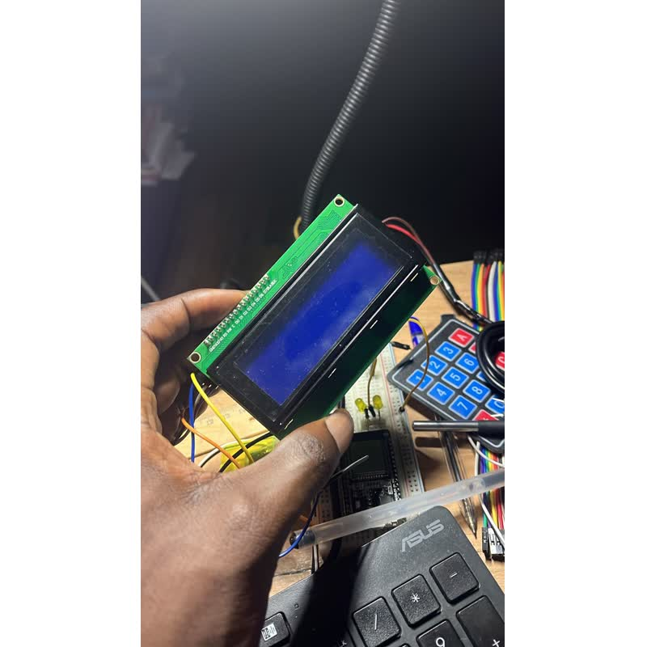
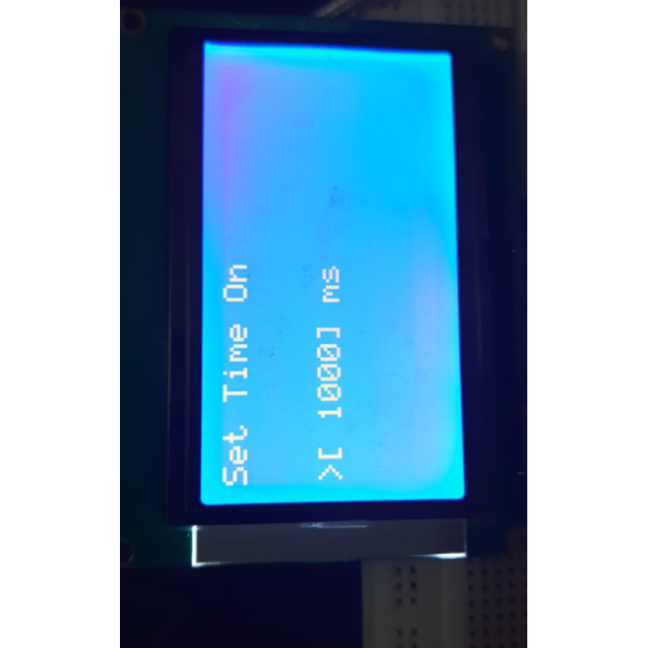
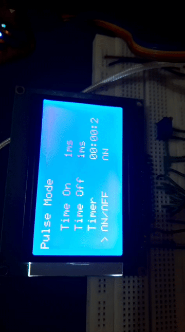
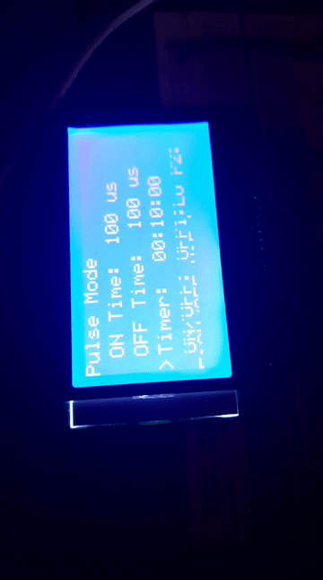

# Complementary Pulse Generator & Timer System

##  Project Overview
This project involves the development of an embedded system designed to generate highly configurable complementary pulses. Based on a PIC18F microcontroller, the system features a dedicated keypad for user input and a graphic LCD for real-time parameter monitoring. 

---

##  Hardware Specifications

The system is built using the following core hardware components:
* **Microcontroller**: PIC18F46Q84-I/P.
* **Display**: 12864B Graphic Blue Color Backlight LCD Display Module.
* **Input Device**: A custom keypad consisting of 21 switches.
* **Status Indicator**: An LED that reflects the operational state of the pulses.

##  Software & Tools
* **Development Environment**: MPLAB IDE.
* **Programming/Debugging Tool**: Pickit-3.

---

##  Functional Requirements & Features

The system is programmed to fulfill the following operational criteria:

### Pulse Generation
* The system requires the generation of two complimentary pulses.
* The "on time" and "off time" of the pulses can be adjusted directly from the keypad.
* The allowable range for the on time and off time values spans from 100us to 9999s.
* The user can enter any value within this specified range with a precise 1us resolution.

### User Interface & Display
* The display shows the exact data entered from the keypad, specifically displaying the pulse on time and off time in us/ms/s.
* The keypad includes an ON/OFF button specifically used to turn on the pulses.

### Timer Integration & Automation
* The system provides an adjustable timer.
* The timer's count range operates from 100us to 9999s.
* Users can input any timer value within this range with a 1us resolution.
* The timer starts automatically as soon as the ON/OFF button is pressed to turn on the pulses.
* The pulses will turn off automatically once the timer finishes its counting sequence.
* A status LED is configured to turn ON when the pulses are active and will turn OFF when the pulses are inactive.

---

## Circuit Design

### Full System Schematic (Proteus)
LCD, keypad, and PIC18F microcontroller wiring as simulated in Proteus.

.png>)

### Keypad Matrix Schematic
21-switch keypad wired as a 5x4 matrix.

.png>)

---

## Hardware Build

### Graphic LCD Display Module
The 12864B graphic LCD used for real-time parameter monitoring.

.jpeg>)

### LCD Output
The LCD displaying the pulse "on time" set via the keypad.

.png>)

---

## Testing & Verification

### Oscilloscope Output
Captured complementary pulse waveform verifying correct on/off timing.

.png>)

### Demo Videos

**Demo 1** — Setting the pulse on/off times and timer via the keypad.

*Full-quality recording: [Display2.mp4](Display2.mp4).*

**Demo 2** — Full walkthrough of the pulse generator and timer in operation.

*Full-quality recording: [Display5.mp4](Display5.mp4).*
